# Performance Diagnostics & Architecture Analysis

This document contains visual diagrams exposing performance bottlenecks, rendering issues, and architectural problems in your OneLibro finance app.

---

## 1. Navigation & User Flow Diagram

```mermaid
graph TD
    Start[User Opens App] --> Login[/finance/login]
    Login -->|Auth Success| Dashboard[/finance/dashboard]
    
    Dashboard -->|Click Transactions| TxPage[/finance/transactions]
    Dashboard -->|Click Accounts| AccPage[/finance/accounts]
    Dashboard -->|Click Budgets| BudPage[/finance/budgets]
    Dashboard -->|Click Settings| SetPage[/finance/settings]
    
    TxPage -->|Back Button| Dashboard
    AccPage -->|Back Button| Dashboard
    BudPage -->|Back Button| Dashboard
    SetPage -->|Back Button| Dashboard
    
    TxPage -->|Navigate Away| FullReload[❌ FULL PAGE RELOAD]
    AccPage -->|Navigate Away| FullReload
    BudPage -->|Navigate Away| FullReload
    
    FullReload -->|Re-renders Everything| NewPage[New Page]
    NewPage -->|Shows Loading Spinner| BlankScreen[⏱️ 5-13 seconds blank]
    BlankScreen -->|Fetch Complete| Content[Content Appears]
    
    style FullReload fill:#ff6b6b,stroke:#c92a2a,color:#fff
    style BlankScreen fill:#ffa94d,stroke:#fd7e14,color:#000
    style Login fill:#51cf66,stroke:#37b24d
    style Dashboard fill:#51cf66,stroke:#37b24d
    
    %% Problem annotations
    Dashboard -.->|PROBLEM: No persistent sidebar| TxPage
    TxPage -.->|PROBLEM: Header re-renders| Dashboard
    NewPage -.->|PROBLEM: No data prefetch| BlankScreen
```

### 🔴 Key Issues Identified:
- **No persistent navigation**: Every route change rebuilds the header/nav
- **Star topology**: All routes hub through dashboard (back button always returns there)
- **No direct navigation**: Can't go from Transactions → Accounts without reload
- **Blank screen on every navigation**: No loading skeleton or cached data

---

## 2. Data Flow & Network Call Diagram

```mermaid
graph TB
    subgraph "Browser - Client Components"
        DashboardPage[Dashboard Page<br/>useEffect]
        TxPage[Transactions Page<br/>useEffect]
        AccPage[Accounts Page<br/>useEffect]
        PlaidLink[PlaidLink Component]
    end
    
    subgraph "API Routes - Edge/Serverless"
        CreateToken[/api/plaid/create-link-token]
        ExchangeToken[/api/plaid/exchange-token]
        SyncTx[/api/plaid/sync-transactions]
    end
    
    subgraph "External Services"
        Plaid[Plaid API<br/>🔴 3-5s latency]
        Supabase[(Supabase PostgreSQL<br/>🟡 1-2s per query)]
    end
    
    subgraph "Data Operations"
        GetAccounts[getUserAccounts<br/>🔴 Serial fetch]
        GetTx[getUserTransactions<br/>🔴 Fetches 500 rows]
        GetProfile[getServerUser<br/>🟡 2 queries]
    end
    
    %% Dashboard flow
    DashboardPage -->|1. Mount| GetAccounts
    DashboardPage -->|2. Then fetch| GetTx
    GetAccounts -->|Query 1| Supabase
    GetTx -->|Query 2| Supabase
    GetTx -->|Includes JOIN| Supabase
    
    %% Transactions page flow
    TxPage -->|Mount| GetTx
    GetTx -->|🔴 NO CACHE| Supabase
    
    %% Accounts page flow
    AccPage -->|Mount| GetAccounts
    GetAccounts -->|🔴 NO CACHE| Supabase
    
    %% Plaid flow
    PlaidLink -->|Click Connect| CreateToken
    CreateToken -->|Verify user| GetProfile
    GetProfile -->|Query 1: auth.getUser| Supabase
    GetProfile -->|Query 2: users table| Supabase
    CreateToken -->|🔴 SLOW| Plaid
    
    PlaidLink -->|After auth| ExchangeToken
    ExchangeToken -->|Store token| Supabase
    ExchangeToken -->|Call Plaid| Plaid
    
    SyncTx -->|Fetch new tx| Plaid
    SyncTx -->|Insert/update| Supabase
    
    style Plaid fill:#ff6b6b,stroke:#c92a2a,color:#fff
    style GetTx fill:#ff6b6b,stroke:#c92a2a,color:#fff
    style GetAccounts fill:#ff6b6b,stroke:#c92a2a,color:#fff
    style Supabase fill:#ffa94d,stroke:#fd7e14
    style DashboardPage fill:#74c0fc,stroke:#339af0
    style TxPage fill:#74c0fc,stroke:#339af0
    style AccPage fill:#74c0fc,stroke:#339af0
```

### 🔴 Critical Bottlenecks:
1. **Serial fetching**: Dashboard fetches accounts, *then* transactions (not parallel)
2. **No caching**: Every page navigation re-fetches the same data
3. **Large queries**: Fetching 500 transactions at once (no pagination)
4. **Plaid latency**: Create-link-token takes 3-8 seconds
5. **Double queries**: `getServerUser` queries twice (auth + profile)
6. **Client-side waterfalls**: Component mount → fetch → render → done

---

## 3. Next.js App Router Architecture

```mermaid
graph TD
    subgraph "Current Architecture ❌"
        RootLayout[app/layout.tsx<br/>Minimal root layout]
        FinanceLayout[app/finance/layout.tsx<br/>AuthProvider + Theme<br/>🔴 NO SIDEBAR]
        
        RootLayout --> FinanceLayout
        
        FinanceLayout --> DashPage[dashboard/page.tsx<br/>🔴 Own header + nav]
        FinanceLayout --> TxPage[transactions/page.tsx<br/>🔴 Own header + nav]
        FinanceLayout --> AccPage[accounts/page.tsx<br/>🔴 Own header + nav]
        FinanceLayout --> BudPage[budgets/page.tsx<br/>🔴 Own header + nav]
        FinanceLayout --> SetPage[settings/page.tsx<br/>🔴 Own header + nav]
        
        DashPage -.->|Navigation| Remount[🔴 Everything re-renders]
        TxPage -.->|Navigation| Remount
        AccPage -.->|Navigation| Remount
        
        Remount --> LoadSpinner[⏱️ Loading spinner 5-13s]
    end
    
    subgraph "Recommended Architecture ✅"
        NewRoot[app/layout.tsx<br/>Root layout]
        NewFinLayout[app/finance/layout.tsx<br/>🟢 PERSISTENT SIDEBAR + NAV]
        
        NewRoot --> NewFinLayout
        
        NewFinLayout -->|Sidebar stays mounted| NewDash[dashboard/page.tsx<br/>✅ Content only]
        NewFinLayout -->|Sidebar stays mounted| NewTx[transactions/page.tsx<br/>✅ Content only]
        NewFinLayout -->|Sidebar stays mounted| NewAcc[accounts/page.tsx<br/>✅ Content only]
        
        NewDash -.->|Navigation| InstantSwitch[✅ Instant content swap]
        NewTx -.->|Navigation| InstantSwitch
        NewAcc -.->|Navigation| InstantSwitch
        
        InstantSwitch --> CachedData[✅ Cached data or skeleton]
    end
    
    style RootLayout fill:#fff,stroke:#dee2e6
    style FinanceLayout fill:#ff6b6b,stroke:#c92a2a,color:#fff
    style DashPage fill:#ffa94d,stroke:#fd7e14
    style TxPage fill:#ffa94d,stroke:#fd7e14
    style AccPage fill:#ffa94d,stroke:#fd7e14
    style Remount fill:#ff6b6b,stroke:#c92a2a,color:#fff
    style LoadSpinner fill:#ffa94d,stroke:#fd7e14
    
    style NewFinLayout fill:#51cf66,stroke:#37b24d,color:#fff
    style NewDash fill:#d0ebff,stroke:#339af0
    style NewTx fill:#d0ebff,stroke:#339af0
    style NewAcc fill:#d0ebff,stroke:#339af0
    style InstantSwitch fill:#51cf66,stroke:#37b24d,color:#fff
    style CachedData fill:#51cf66,stroke:#37b24d,color:#fff
```



### 🔴 Current Problems:
- Each page renders its own header → full re-render on navigation
- No persistent UI elements (sidebar, nav) that survive route changes
- Layout.tsx only provides context, not structure

### ✅ Solution:
Move header/sidebar into `finance/layout.tsx` so only page content changes on navigation.

---

## 4. Request Timeline & Latency Analysis

```mermaid
gantt
    title Navigation Timeline: Dashboard → Transactions (Current vs Optimized)
    dateFormat X
    axisFormat %Ss
    
    section Current (13s total)
    User clicks Transactions: milestone, 0, 0
    Next.js route change: 0, 500ms
    🔴 Page unmount + remount: 500ms, 800ms
    🔴 useEffect triggers: 800ms, 850ms
    🔴 getUserTransactions call: 850ms, 1000ms
    🔴 Supabase query (500 rows): crit, 1000ms, 13000ms
    🔴 Process + render data: 13000ms, 13500ms
    User sees content: milestone, 13500ms, 13500ms
    
    section Optimized (1.5s)
    User clicks Transactions: milestone, 0, 0
    Next.js route change: 0, 100ms
    ✅ Only content swaps (sidebar stays): 100ms, 200ms
    ✅ SWR cache check: 200ms, 220ms
    ✅ Cached data renders: 220ms, 300ms
    ✅ Background revalidation: 300ms, 1500ms
    User sees cached content instantly: milestone, 300ms, 300ms
    Fresh data updates in bg: milestone, 1500ms, 1500ms
```

### Detailed Latency Breakdown

#### Current Flow (13 seconds):
```
0ms      User clicks "Transactions"
+500ms   Next.js client-side navigation begins
+300ms   🔴 Page component unmounts (cleanup)
+50ms    🔴 New page component mounts
+150ms   🔴 useEffect(() => {}, [user]) triggers
+1000ms  🔴 Supabase connection + query planning
+11000ms 🔴 Fetch 500 transactions with JOIN (accounts table)
+500ms   🔴 Client-side processing (filter, map, setState)
+500ms   React reconciliation + DOM updates
= 13000ms total (user sees blank screen)
```

#### Optimized Flow (1.5 seconds):
```
0ms      User clicks "Transactions"
+100ms   Next.js navigation (sidebar stays mounted)
+20ms    ✅ SWR checks cache
+80ms    ✅ Render cached transactions (instant)
+1300ms  ✅ Background fetch + revalidate
= 300ms to interactive (cache hit)
= 1500ms to fresh data
```

---

## 5. Component Render Tree & Re-render Analysis

```mermaid
graph TD
    subgraph "Current: Every Navigation Re-renders Everything"
        Nav1[Navigation Event]
        Nav1 --> Unmount[🔴 Unmount entire page]
        Unmount --> Mount[🔴 Mount new page]
        Mount --> Header[🔴 Render header]
        Mount --> Nav[🔴 Render nav buttons]
        Mount --> Theme[🔴 Re-init theme context]
        Mount --> Auth[🔴 Re-check auth]
        Mount --> Content[🔴 Render content]
        Mount --> Fetch[🔴 Trigger useEffect]
        Fetch --> Wait[⏱️ Wait 5-13s]
        Wait --> Update[🔴 Re-render with data]
    end
    
    subgraph "Optimized: Only Content Changes"
        Nav2[Navigation Event]
        Nav2 --> PersistUI[✅ Sidebar/header stay mounted]
        Nav2 --> SwapContent[✅ Swap content only]
        SwapContent --> CheckCache[✅ Check SWR cache]
        CheckCache -->|Cache hit| Instant[✅ Render cached data 50ms]
        CheckCache -->|Cache miss| BgFetch[✅ Fetch in background]
        Instant --> BgRevalidate[✅ Revalidate silently]
    end
    
    style Unmount fill:#ff6b6b,stroke:#c92a2a,color:#fff
    style Mount fill:#ff6b6b,stroke:#c92a2a,color:#fff
    style Header fill:#ffa94d,stroke:#fd7e14
    style Nav fill:#ffa94d,stroke:#fd7e14
    style Fetch fill:#ff6b6b,stroke:#c92a2a,color:#fff
    style Wait fill:#ffa94d,stroke:#fd7e14
    
    style PersistUI fill:#51cf66,stroke:#37b24d,color:#fff
    style SwapContent fill:#51cf66,stroke:#37b24d,color:#fff
    style Instant fill:#51cf66,stroke:#37b24d,color:#fff
    style CheckCache fill:#d0ebff,stroke:#339af0
```



---

## 6. Data Fetching Strategy Comparison


---

## 7. Recommended Fixes (Priority Order)

### 🔴 Critical (Do First):


### Implementation Checklist:

#### ✅ Phase 1: Quick Wins (1-2 hours)
- [ ] Move sidebar/header into `finance/layout.tsx`
- [ ] Install SWR: `npm install swr`
- [ ] Wrap app with SWRConfig
- [ ] Convert dashboard to use parallel `Promise.all`
- [ ] Reduce transaction query from 500 → 50 rows

**Expected improvement**: 13s → 3-4s

#### ✅ Phase 2: Caching Layer (2-3 hours)
- [ ] Create custom SWR hooks for accounts/transactions
- [ ] Add `dedupingInterval: 60000` (1min cache)
- [ ] Implement optimistic UI for mutations
- [ ] Add loading skeletons instead of spinners

**Expected improvement**: 3-4s → 500ms (cached)

#### ✅ Phase 3: Server Components (4-6 hours)
- [ ] Convert layout to Server Component
- [ ] Move initial data fetch to server
- [ ] Use `<Suspense>` boundaries
- [ ] Stream data with React 18

**Expected improvement**: 500ms → 200ms (SSR)

---

## 8. Performance Monitoring Dashboard

```mermaid
graph TB
    subgraph "Metrics to Track"
        M1[Time to Interactive TTI]
        M2[First Contentful Paint FCP]
        M3[Largest Contentful Paint LCP]
        M4[API Response Time]
        M5[Cache Hit Rate]
    end
    
    subgraph "Current Values 🔴"
        V1[TTI: 13000ms]
        V2[FCP: 5000ms]
        V3[LCP: 13000ms]
        V4[API: 8000ms avg]
        V5[Cache: 0%]
    end
    
    subgraph "Target Values ✅"
        T1[TTI: <300ms]
        T2[FCP: <1000ms]
        T3[LCP: <2500ms]
        T4[API: <500ms]
        T5[Cache: >80%]
    end
    
    M1 --> V1
    M2 --> V2
    M3 --> V3
    M4 --> V4
    M5 --> V5
    
    V1 -.->|Optimize| T1
    V2 -.->|Optimize| T2
    V3 -.->|Optimize| T3
    V4 -.->|Optimize| T4
    V5 -.->|Optimize| T5
    
    style V1 fill:#ff6b6b,color:#fff
    style V2 fill:#ff6b6b,color:#fff
    style V3 fill:#ff6b6b,color:#fff
    style V4 fill:#ffa94d
    style V5 fill:#ff6b6b,color:#fff
    
    style T1 fill:#51cf66,color:#fff
    style T2 fill:#51cf66,color:#fff
    style T3 fill:#51cf66,color:#fff
    style T4 fill:#51cf66,color:#fff
    style T5 fill:#51cf66,color:#fff
```



---

## Summary: Root Causes & Solutions

| Problem | Impact | Solution | Time Saved |
|---------|--------|----------|------------|
| No persistent layout | Full page re-render | Move nav to layout.tsx | 2-3s per nav |
| No caching | Re-fetch same data | Implement SWR | 5-10s per nav |
| Serial fetching | Waterfall delays | Promise.all | 3-5s |
| Large queries (500 rows) | Slow Supabase | Pagination (50 rows) | 8-10s |
| Client-side only | Blank screen wait | Server Components | 2-4s |
| No loading states | Poor UX | Skeletons + Suspense | N/A (UX) |

**Total potential improvement**: 13s → 0.3s (cached) / 1.5s (uncached)

---

## Next Steps

1. **Start with Phase 1** (persistent layout + parallel fetching)
2. **Measure improvement** with Chrome DevTools Performance tab
3. **Add SWR caching** (Phase 2)
4. **Consider Server Components** if you need SEO/initial load speed

Would you like me to implement any of these fixes?
