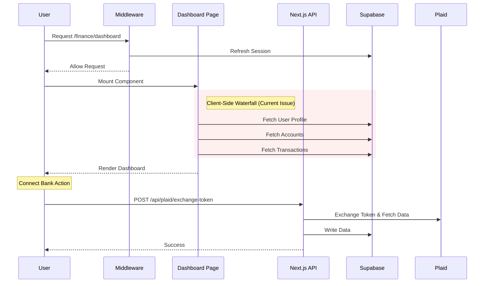

# Project Development & Architecture Guide

This document outlines the architecture, user flows, and performance considerations for the `yatheeshnagella.com` ecosystem.

## 1. Global Routing Architecture

The application uses **Next.js Rewrites** (in `next.config.ts`) to map subdomains to specific route groups within the single Next.js application. This allows for a multi-tenant-like experience while maintaining a single codebase.

```mermaid
graph TD
    User((User))
    
    subgraph "Edge Network (Vercel)"
        DNS[DNS / Load Balancer]
        Middleware[Middleware.ts<br/>(Session Refresh)]
    end
    
    subgraph "Next.js Server (App Router)"
        Router{URL Rewrite Logic}
        
        subgraph "Route Groups"
            Portfolio["/ (Root)<br/>app/page.jsx"]
            Finance["/finance/*<br/>app/finance/"]
            Admin["/admin/*<br/>app/admin/"]
        end
    end

    User -->|yatheeshnagella.com| DNS
    User -->|finance.yatheeshnagella.com| DNS
    User -->|admin.yatheeshnagella.com| DNS
    
    DNS --> Middleware
    Middleware --> Router
    
    Router -->|Host: yatheeshnagella.com| Portfolio
    Router -->|Host: finance.yatheeshnagella.com| Finance
    Router -->|Host: admin.yatheeshnagella.com| Admin
```

---

## 2. Domain-Specific Architectures

### A. Portfolio (`yatheeshnagella.com`)
**Type**: Single Page Application (SPA) feel, Client-Heavy.
**Key Tech**: Framer Motion, React Context (minimal).

```mermaid
graph LR
    User -->|Visits| Page[app/page.jsx]
    
    subgraph "Client Side (Browser)"
        Page --> Hero[Hero Section]
        Page --> Projects[Projects Grid]
        Page --> Exp[Experience Timeline]
        
        subgraph "Interactivity"
            Motion[Framer Motion<br/>(Animations)]
            Modal[Resume Modal]
            Nav[Mobile Menu]
        end
        
        Hero -.-> Motion
        Projects -.-> Motion
    end
    
    subgraph "Performance Bottlenecks"
        Bundle[Large JS Bundle<br/>(Framer Motion + All Sections)]
        Hydration[ hydration mismatch risk]
    end
```

### B. Finance App (`finance.yatheeshnagella.com`)
**Type**: Dashboard, Data-Heavy, Protected.
**Key Tech**: Supabase Auth, Plaid API, Recharts.



### C. Admin Dashboard (`admin.yatheeshnagella.com`)
**Type**: Management Interface, High Privilege.
**Key Tech**: Supabase Service Role, User Management.

```mermaid
graph TD
    Admin((Admin User))
    
    subgraph "Admin Routes"
        Login[Admin Login]
        Dashboard[Admin Dashboard]
        Users[User Management]
        Invites[Invite Codes]
    end
    
    subgraph "Data Layer"
        Supabase[Supabase DB]
        RLS[Row Level Security<br/>(is_admin = true)]
    end

    Admin --> Login
    Login -->|Auth Success| Dashboard
    Dashboard --> Users
    Dashboard --> Invites
    
    Users -->|CRUD| Supabase
    Invites -->|Generate| Supabase
    
    style RLS fill:#ffcccc,stroke:#ff0000
```

---

## 3. Latency Reduction & Performance Recommendations

### 1. Optimize Middleware
**Current**: Middleware runs on *every* request (excluding static files) to refresh Supabase sessions.
**Fix**: Ensure the matcher in `middleware.ts` is as specific as possible. If the Portfolio (`/`) doesn't need auth, exclude it from the middleware to speed up the landing page.

```typescript
// Recommended Matcher
export const config = {
  matcher: [
    '/finance/:path*',
    '/admin/:path*',
    // Exclude root / for Portfolio performance
  ],
};
```

### 2. Fix Data Waterfalls (Finance)
**Current**: `Dashboard` fetches User -> Accounts -> Transactions sequentially.
**Fix**: Use `Promise.all` to fetch in parallel, or better yet, move data fetching to **Server Components** (`page.tsx` becomes `async`).

```typescript
// Server Component Approach
export default async function Dashboard() {
  const [accounts, transactions] = await Promise.all([
    getAccounts(),
    getTransactions()
  ]);
  
  return <DashboardClient accounts={accounts} transactions={transactions} />;
}
```

### 3. Code Splitting (Portfolio)
**Current**: The Portfolio is one giant file (`app/page.jsx`).
**Fix**: Break sections (Hero, Projects, Experience) into separate components. Use `next/dynamic` to lazy load heavy interactive elements like the **Resume Modal** or complex **Framer Motion** animations that aren't immediately visible.

### 4. Edge Caching
**Recommendation**: For the Portfolio, ensure the `Cache-Control` headers are set correctly. Since it's mostly static content, it can be cached heavily at the Vercel Edge.

### 5. Plaid Webhooks
**Current**: The user waits for the initial sync (Accounts + Transactions) during the connection phase.
**Fix**: Offload transaction syncing to a **Background Job** or **Webhook Handler**. Return "Success" to the user immediately after the Token Exchange, and show a "Syncing..." state in the UI while the backend processes the data asynchronously.
