UI improvements & Name change:

So we changed the name of OneLedger to OneLibro to better reflect our mission of creating an inclusive and accessible financial ecosystem for everyone. Along with the name change, we have made several UI improvements to enhance user experience across our platform.

Key UI Improvements:
1. Redesigned Dashboard: The dashboard has been revamped to provide a more intuitive and user-friendly interface, making it easier for users to navigate and access key features.
2. Redesigned every page with a fresh look: We have updated the design of every page on our platform to ensure a consistent and modern aesthetic that aligns with our brand identity.
3. Improved Accessibility

You can also propse changes on UI and iam uploading the screenshots of our UI here please go through each of them and suggest changes if any.

Landing page:
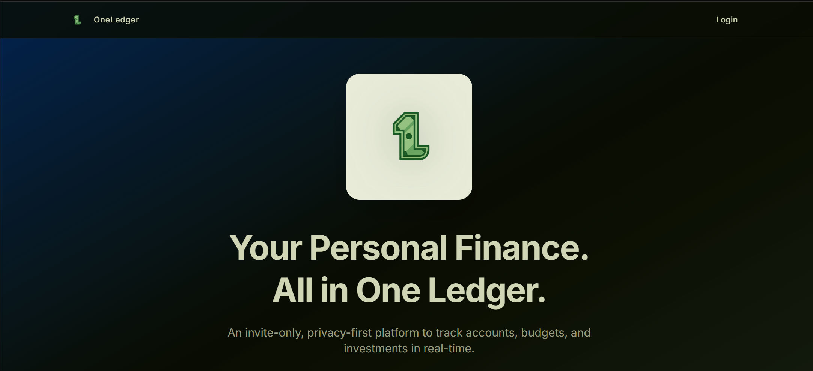
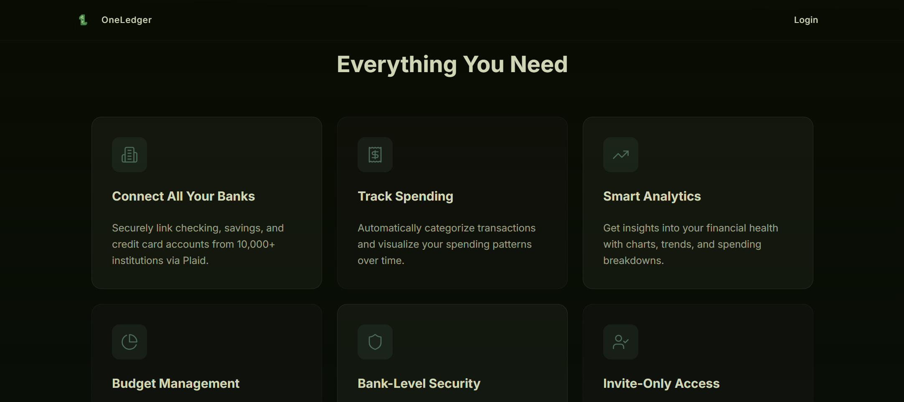
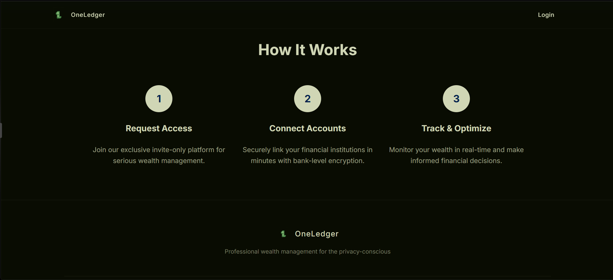
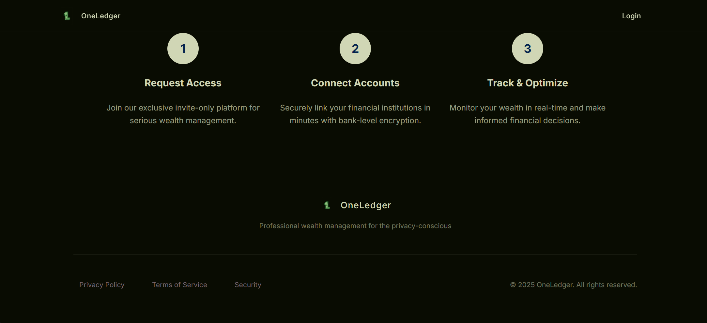

Login/signup page:
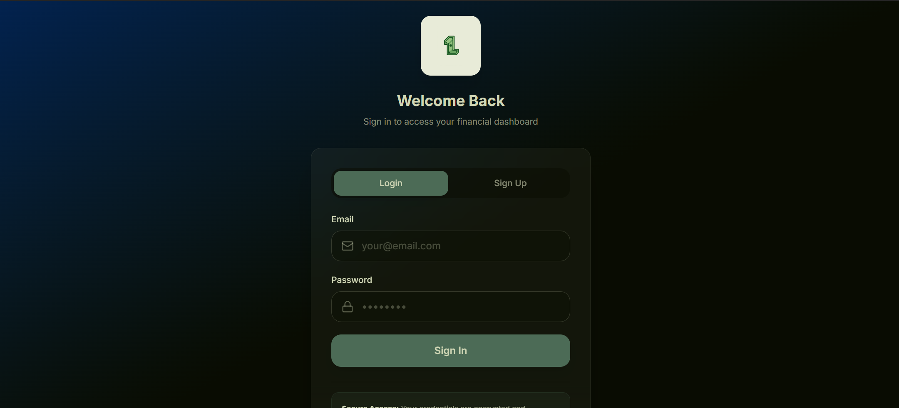
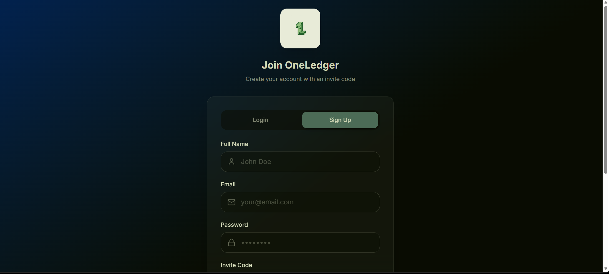

Dashboard:
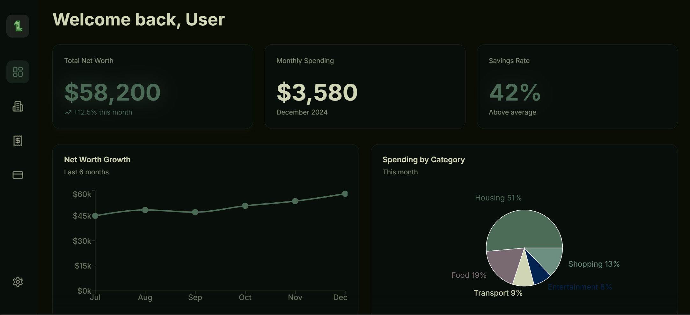
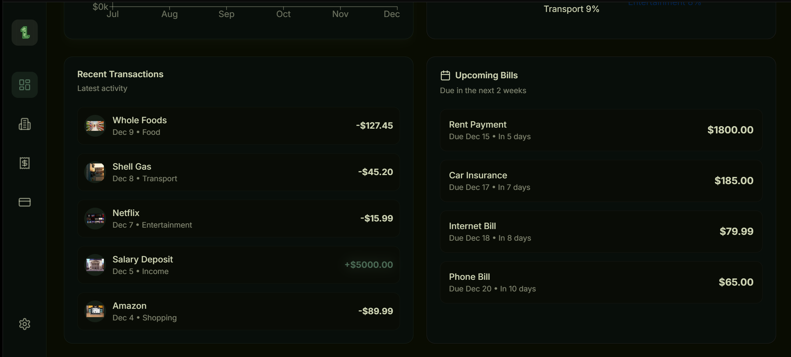

Account page:
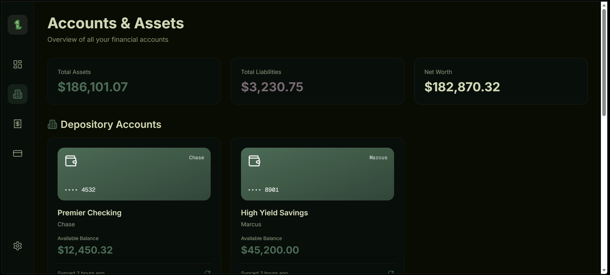
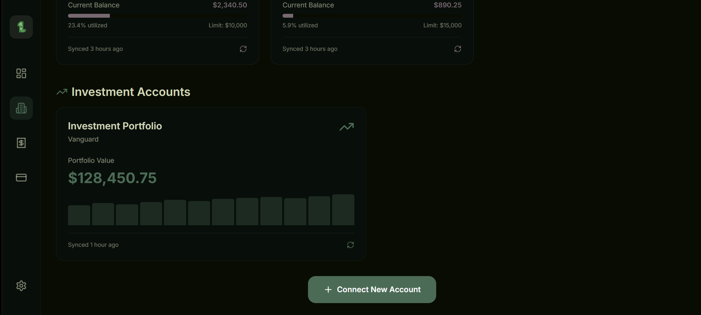

Transaction page:
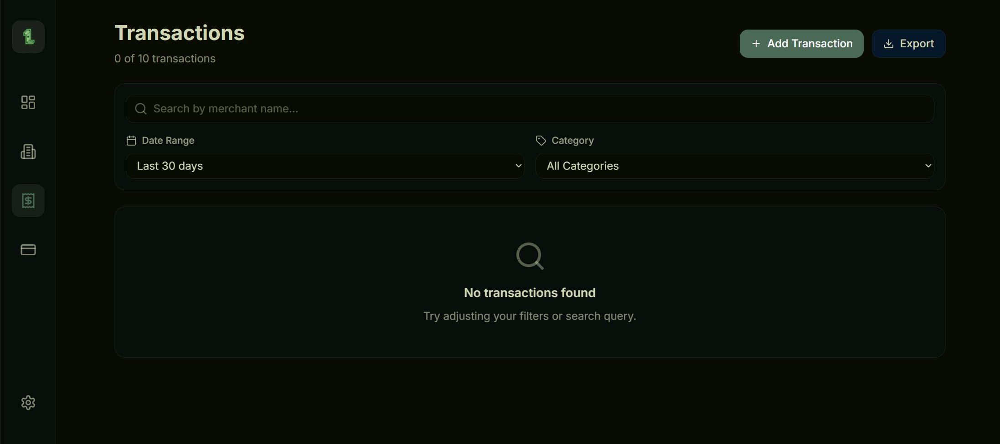

Budget:

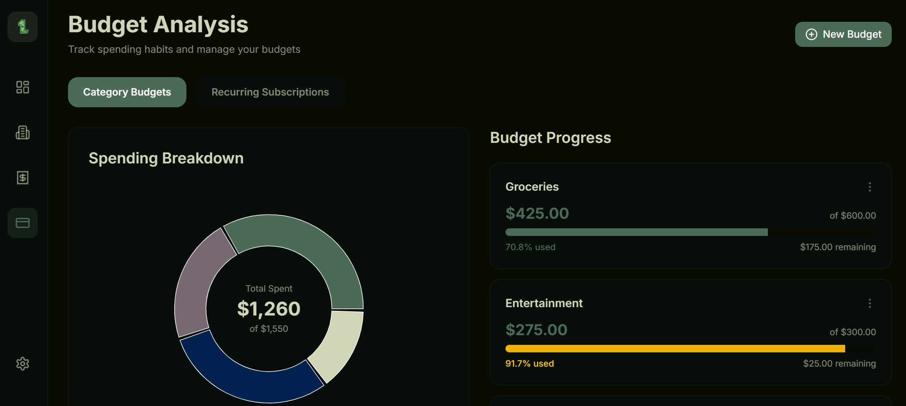
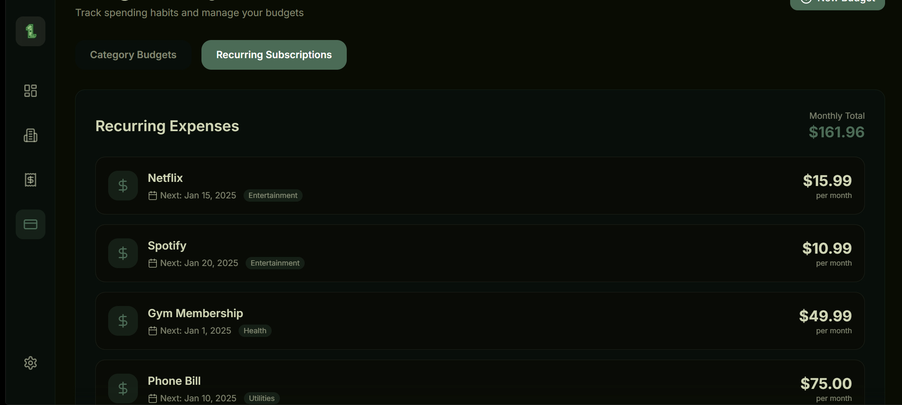

Settings:
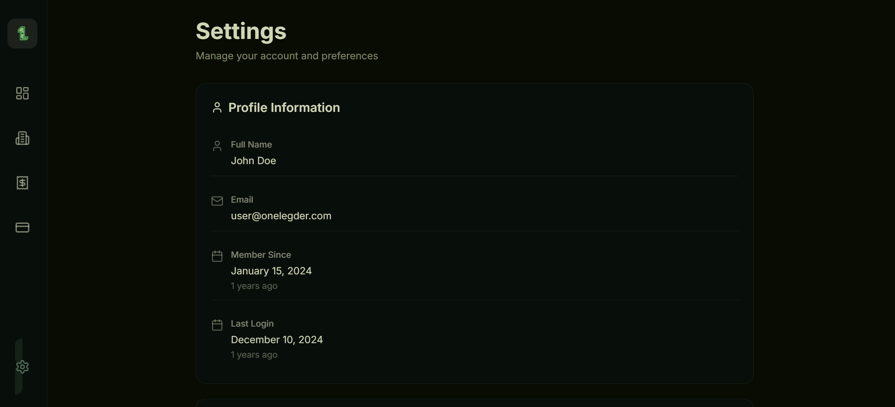

OneLibro logo:

